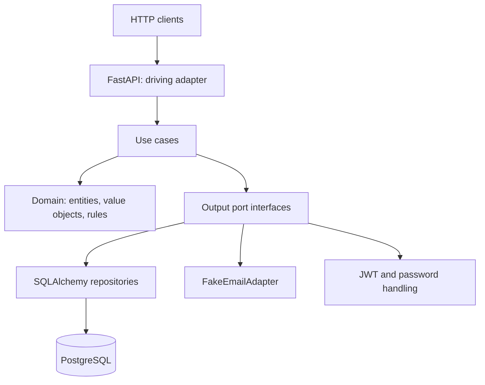
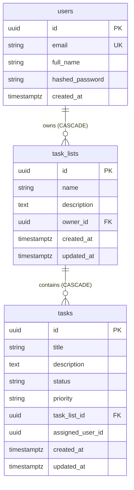

# Decision log

This document records the main technical choices for the Task Manager API and how they meet the challenge goals: clear boundaries, testability, async performance, and maintainable operations.

## Hexagonal architecture (ports and adapters)

The project uses **hexagonal (ports and adapters) layout** so the core stays independent from HTTP, the database, email, and JWT details.

### Why hexagonal naming instead of only “Clean architecture”

**Clean architecture** and **hexagonal** share the same core idea: keep business rules at the center and depend **inward**, so infrastructure and frameworks are replaceable. Clean often describes **concentric layers** (entities, use cases, interface adapters, frameworks) and a strict **dependency rule**; hexagonal uses **port** and **adapter** for every way the app talks to the outside (HTTP, database, email, time, and so on).

This codebase was **labeled and organized as hexagonal** rather than only as “clean” for practical reasons in this case:

- **The vocabulary matches the work**: the challenge and review criteria talk about **ports and adapters** and pluggable behavior (real DB, fake email, JWT). Folders and names like `app/ports` and `app/adapters` map that story directly, which helps reviewers and future readers without reinterpreting a layer diagram.
- **Explicit contracts per side effect**: a **port** is declared for each external concern (persistence, notification, token handling). That is a simple checklist: every I/O has an interface, a test double, and one main implementation. “Clean” alone can be read as layers only; **hexagonal** makes **interfaces at boundaries** the main design unit, which is what you want for isolated tests and mock notifications.
- **No extra structure for a single service**: a full “clean” stack (extra distinction between, say, use-case-only interfaces and “interface adapters” for every small detail) would add **ceremony** here without changing behavior. Hexagonal is enough to draw the line between **driving** adapter (HTTP) and **driven** adapters (DB, email, auth) for a single API surface.
- **Not a rejection of clean rules**: the domain and application still follow the dependency direction that Clean describes; hexagonal is the **shape of the solution** in this repository, not a different set of business rules.

- **Domain** holds entities, value objects, and custom exceptions. It has no imports from FastAPI, SQLAlchemy, or Pydantic, so business rules stay pure and easy to reason about in isolation.
- **Application** use cases orchestrate work and depend only on **output port** interfaces (repositories, email, auth), not on concrete drivers.
- **Input ports** describe what the API layer must call; they use Pydantic DTOs at the boundary. **Output ports** describe what the application needs from the outside (persist users, lists, and tasks, send fake mail, sign and verify tokens).

**Why this helps**

- **Swappable adapters**: you can replace PostgreSQL with another store or change how JWT is issued without touching domain or use case code, as long as the port contract stays the same.
- **Email as a port**: the challenge asks for a mock notification, not a real SMTP stack. The `IEmailPort` is implemented by a small **FakeEmailAdapter**; a real provider would implement the same interface later.
- **Testability**: unit tests use in-memory fakes for repositories and ports. Integration tests hit the HTTP layer with a test database, so both fast feedback and end-to-end behavior are covered.

### Architecture diagram

The figure below is a simplified view of **who calls what**. HTTP and OpenAPI sit on the **driving** side. **Use cases** and the **domain** are at the center. **Driven** adapters implement output port interfaces: persistence, fake email, and token or password work. The domain never imports FastAPI, SQLAlchemy, or the adapters. Integration and unit tests swap adapters for fakes or SQLite without changing the domain.

## PostgreSQL with asyncpg

**PostgreSQL** is the real database. The **asyncpg** driver is used with SQLAlchemy’s async engine so that database I/O does not block the event loop in async route handlers. That keeps latency predictable under concurrent requests and matches the async use case and repository methods.

## Async SQLAlchemy 2.0

**SQLAlchemy 2.0** style (select/update/delete constructs, `AsyncSession`, async engine) is used in repository adapters. The **application layer** stays free of ORM details; only the output adapters map between domain entities and rows.

**Alembic** runs in a **synchronous** context: the migration env [alembic/env.py](alembic/env.py) rewrites the app’s `DATABASE_URL` by replacing `postgresql+asyncpg` with `postgresql+psycopg` for the sync migration engine, while the running app keeps `postgresql+asyncpg` for async I/O. That split is a common pattern: one tool for schema evolution, another for the async runtime.

### Data model (persistence)

The relational model matches the SQLAlchemy models in `app/adapters/output/db/models/`. **users** own **task_lists**; each **task** belongs to one list and may reference an **assignee** (another user) or `NULL`. Foreign keys: `task_lists.owner_id` cascades on user delete, `tasks.task_list_id` cascades on list delete, `tasks.assigned_user_id` uses **SET NULL** when a user is removed. Status and priority are stored as short strings, aligned with domain enums.

A task can optionally reference `users.id` as **assignee** on `tasks.assigned_user_id`. That is modeled in SQL with a second foreign key from **tasks** to **users** and **ON DELETE SET NULL**; a third edge is omitted in the figure so Mermaid does not suggest an incorrect many-to-many.

## Fake email adapter: sync vs async

The `IEmailPort` contract has two methods.

- **Synchronous** `send_invitation_sync` returns a `NotificationResult` so the use case can attach a concrete payload to the HTTP response when a task is created with an assignee (the challenge requires simulating an invitation without sending real email).
- **Asynchronous** `send_invitation_async` returns `None` and is used for a **fire-and-forget** path; the fake implementation only logs, so you can show both code paths without a mail server.

The adapter lives in infrastructure, so a future real implementation can keep the same port and swap behavior.

## JWT with python-jose

**python-jose** issues and validates JWTs with `SECRET_KEY`, `ALGORITHM`, and expiry, using standard `sub` and `exp` claims. It is lightweight for a take-home scope and keeps auth logic in a small **adapters** class behind an auth-related port or dependency, instead of pulling in a large framework.

Invalid or expired tokens are rejected in the FastAPI dependency that resolves the current user, which maps to **401** and the appropriate domain or HTTP handling.

## Task status transitions

Status changes are **not** free-form updates: the domain enforces a small state machine so “done” and “in progress” mean something consistent in reports and in the completion percentage.

Allowed transitions:

- `pending` to `in_progress` (start work)
- `in_progress` to `done` (complete)
- `in_progress` to `pending` (roll back or pause)

Anything else raises `InvalidTaskStatusTransitionException` and is exposed as **422** to the client. This avoids invalid jumps (for example `pending` straight to `done` without an “in progress” step) and keeps the rule list small and testable.

## Password hashing with bcrypt

**passlib** with the **bcrypt** backend hashes passwords on registration; login uses a constant-time verify. A **bcrypt** version compatible with `passlib` is pinned in `requirements.txt` so local runs, CI, and Docker do not hit runtime compatibility issues.

## Docker and Compose

A **multistage Dockerfile** keeps the final image smaller by building dependencies in one stage and copying only what the runtime needs. **docker-compose** runs **PostgreSQL 16** with a health check, then starts the API after `alembic upgrade head` so a new clone can run with one command. The `api` service **overrides** `DATABASE_URL` in the compose file to point at the `db` host, so developers do not have to hand-edit the URL for the container network.

## Tooling: flake8, black, isort, pre-commit, pytest

The challenge requires **flake8** as the linter, **black** for formatting, and a **.flake8** file with project-specific ignores (for example E203 and W503 for Black compatibility). **isort** keeps import order consistent with Black.

**pre-commit** runs formatters and the linter on **commit** and **pytest** on **push**, so the default workflow catches style and test regressions before they reach a shared branch. The **75%** line coverage floor on `app/` is enforced in `pytest.ini` so the minimum bar stays visible in every test run.
